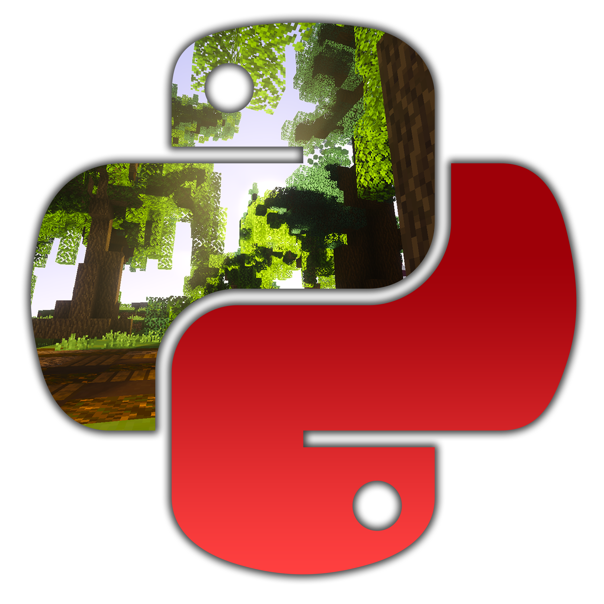

# Nova Universe.py *(Rewrite)*

[](https://discord.gg/4gZSVJ7)
[](https://pypi.org/project/novauniverse/)
[](https://pypi.org/project/novauniverse/ "Supported python versions.")
[](https://novauniversepy.devgoldy.me/)

<p align="center">
 
</p>

### ``novauniverse.py`` - A modern API wrapper for the minecraft server Nova Universe written in Python.

<p align="right">
 
 
 # *What is Nova Universe.py?*
 NovaUniverse.py is a API wrapper for the minecraft server **[Nova Universe](https://novauniverse.net/)** that allows you to access the Nova Universe [API](https://novauniverse.net/api) in a fast object oriented way in Python. One of the bonuses is that it was developed by one of the devs at NovaUniverse.
</p>

<br>

## *Install/Set Up*
1. **Install package from pip.**
```sh
#Windows/Linux

pip install novauniverse
```
2. **That's It!** - *Brief Example Below*
```python
from novauniverse import NovaClient, Events, NovaOnlinePlayer 

client = NovaClient()

@client.on_event(Events.CLIENT_READY)
def client_is_ready():
    print("Client is ready!")

@client.on_event(Events.PLAYER_JOIN)
def on_player_join(player:NovaOnlinePlayer):
    print(f"{player.username} joined {player.server_name}!")

client.start()
```

# *Documentation*

### Documentation has been moved to: 